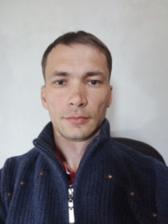

# Алексей Шорохов

## Обо мне
Я из города Омска.
## Образование
Высшее. Закончил ОмГУ им. Ф. М. Достоевского, по специальности «Физик». С программированием знаком довольно давно, всё началось в университете, снала изучали «Pascal», затем «C». С помощью языка «C» я работал с данными для своей дипломной работы. После университета, спустя какое то время самостоятельно с помощью образовательного сервиса «Coursera» изучал «C++». Сейчас, помимо направления "Python разработчик", изучаю Front-end.
## Опыт в IT
Со школы **знаком с HTML и CSS** на базовом уровне. Верстал небольшие веб сайты. Кастомизировал шаблоны для таких CMS как: 
* Joomla
* WordPress
* Getsimple
* MODx
 
Немного **занимался SEO**.
## Контакты
E-mail: alsemva@yandex.ru\
VK: [Алексей Шорохов](https://vk.com/alex611)

